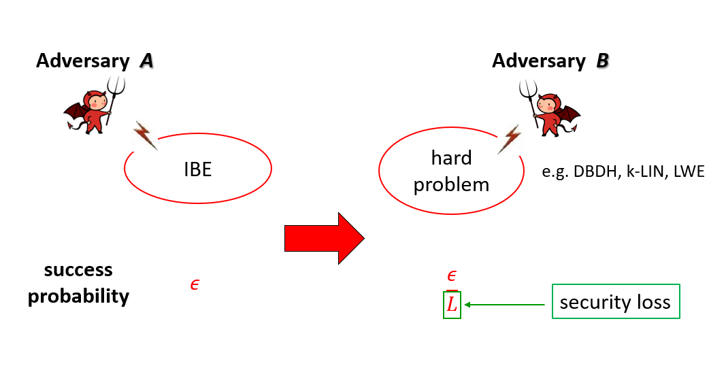

---

title: IBE研究成果
author: dastro yang
date: 2023-12-10
category: Jekyll
layout: post
---

&nbsp;&nbsp;&nbsp;&nbsp;&nbsp;&nbsp;&nbsp;介绍：为了简化公钥密码系统中的证书管理问题，1984年Shamir提出了身份基加密IBE的概念，但直到2001年才由Boneh和Franklin在美密会CRYPTO会上给出了第一个基于随机预言机模型RO（Random Oracle）的可证安全IBE方案。本部分主要介绍实验室在身份基加密IBE方案设计方面的工作，相关成果发表在美密会CRYPTO 2013、亚密会ASIACRYPT 2016&2022、PKC 2016&2017&2021、DCC等上。
 

# 身份基加密IBE的紧归约 

## Fully, (Almost) Tightly Secure IBE from Standard Assumptions and Dual System Groups (CRYPTO 2013)

[查看原文](https://link.springer.com/chapter/10.1007/978-3-642-40084-1_25)

作者：Jie Chen*，Hoeteck Wee

该工作被 “三大会议” 引用40次。

成果简介：

&nbsp;&nbsp;&nbsp;&nbsp;&nbsp;自IBE提出以来，最核心的公开问题是：如何在标准模型（不使用随机预言机RO）、标准假设、适应性安全模型下设计具有紧归约的IBE方案。减少归约损耗不仅具有很强的理论意义，对实践应用也非常重要：为了确保相同的安全性，需要用更大的安全参数来弥补归约损耗，换句话说方案的运行效率也会变低。该工作创新地结合伪随机函数技术，在双系统加密中将密文和私钥按照id逐比特转换，最终使得安全损失只取决于安全参数，与秘钥问询次数无关；并由此基于素数阶群上的DLIN假设给出了第一个同时具备上述四个特性的IBE方案。

# 非对称双线性群下高效IBE方案

## Shorter IBE via Asymmetric Pairings (Pairing 2012)

[查看原文](https://link.springer.com/chapter/10.1007/978-3-642-36334-4_8)

作者：Jie Chen*, Hoon Wei Lim, San Ling, Huaxiong Wang, Hoeteck Wee

该工作被“三大会议”引用10次，且多次被其它方向（领域）的工作关注和高度评价。

成果简介：

&nbsp;&nbsp;&nbsp;&nbsp;&nbsp;&nbsp;&nbsp;该工作利用非对称双线性群及SXDH计算假设来模拟合数阶群，得到了在非对称双线性群下的IBE等方案，整体效率提高30%以上。
