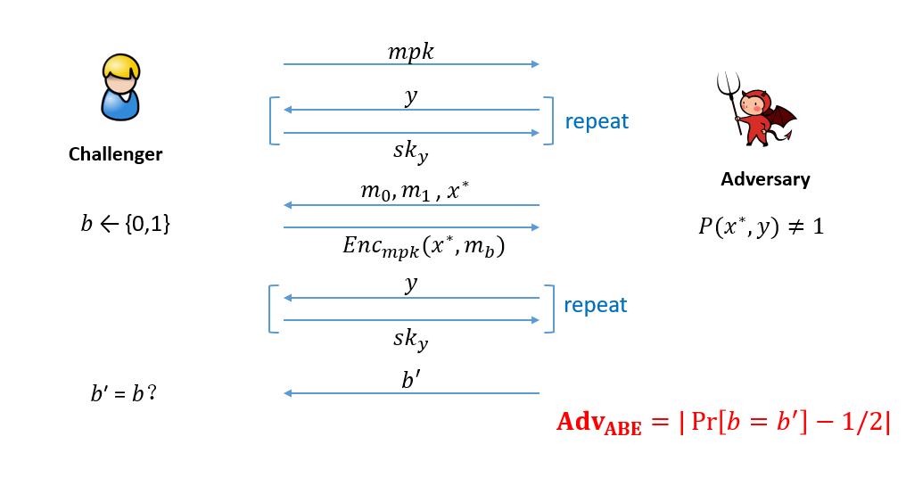
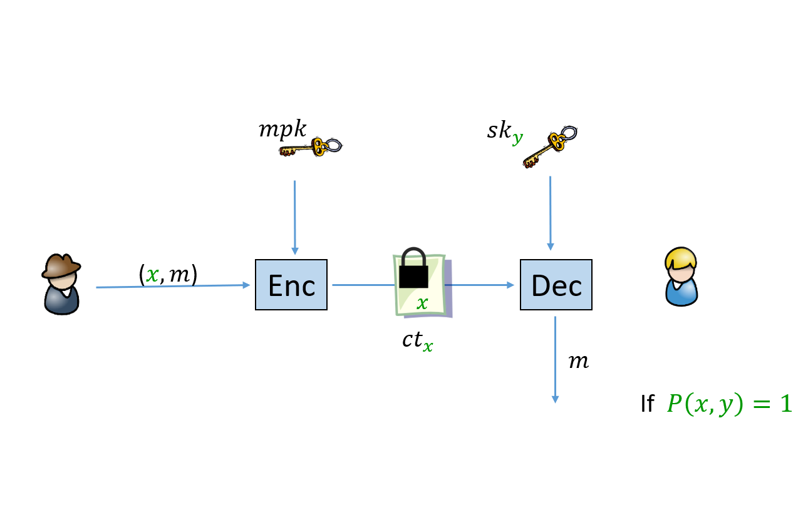

---

title: ABE研究成果
author: dastro yang
date: 2023-12-11
category: Jekyll
layout: post

---

&nbsp;&nbsp;&nbsp;&nbsp;&nbsp;&nbsp;&nbsp;介绍：2005至2006年，Sahai及Goyal等在欧密会EUROCRYPT及CCS会上提出了属性基加密ABE的概念并给出方案的设计，ABE是一种具有访问控制结构的新型公钥加密方法，它将用户私钥和密文与属性相联系，能够灵活表示访问控制策略，从而极大地降低了数据共享细粒度访问控制带来的网络带宽和发送结点的处理开销。ABE在云计算、存储访问控制等领域有着广泛的应用。本部分主要介绍实验室在属性基加密ABE方案设计方面的工作，相关成果发表在欧密会EUROCRYPT 2015 & 2018、亚密会ASIACRYPT 2017&2023、SCN 2014、DCC等上。

# 高效ABE方案的设计
##  [1.Improved Dual System ABE in Prime-Order Groups via Predicate Encodings (EUROCRYPT 2015)](https://link.springer.com/chapter/10.1007/978-3-662-46803-6_20)

作者: Jie Chen*, Romain Gay, Hoeteck Wee 

该工作被“三大会议”引用34次。

成果简介：

&nbsp;&nbsp;&nbsp;&nbsp;&nbsp;&nbsp;&nbsp;该工作给出了基于“双匹配向量空间”的新模拟技术，可将合数阶群方案模拟到素数阶群上，此技术以与先前工作完全不同的方式来模拟“交换律”、“参数隐藏”等性质。同时该工作给出了新型公钥系统模块化构造，提出了多项新技术并得到了大量新方案，运行效率较之前工作有25%-50%的提升，为新型公钥加密的实用化提供了更好的保障。

##  [2.ABE with Tag Made Easy: Concise Framework and New Instantiations in Prime-order Groups (ASIACRYPT 2017)](https://link.springer.com/chapter/10.1007/978-3-319-70697-9_2)

作者：Jie Chen, Junqing Gong*

成果简介：

&nbsp;&nbsp;&nbsp;&nbsp;&nbsp;&nbsp;&nbsp;该工作对基于标签TAG的属性基加密方案的构造和证明给出了全新易懂的思路和分析，同时给出的方案较之前工作也更为高效。

##  [3.Unbounded ABE via Bilinear Entropy Expansion, Revisited (EUROCRYPT 2018)](https://link.springer.com/chapter/10.1007/978-3-319-78381-9_19)

作者：Jie Chen, Junqing Gong*, Lucas Kowalczyk, Hoeteck Wee

该工作被“三大会议”引用14次。

成果简介：

&nbsp;&nbsp;&nbsp;&nbsp;&nbsp;&nbsp;&nbsp;在bounded ABE方案中，需要在系统开始时就设定属性空间，而在unbounded ABE方案中则不需要在系统开始时就设定。该工作证明了 “熵膨胀引理”，即在双系统方法下，生产多项式级别的熵Entropy，只需常数个元素的参数（之前的工作最小需要log级别的参数），并且由此提出了适应性安全的且具有恒定大小的公共参数的unbouned ABE方案，较原有方案更为简洁。

## 4. Improved Fully Adaptive Decentralized MA-ABE for NC1 from MDDH (ASIACRYPT 2023)

作者：Jie Chen, Qiaohan Chu*, Ying Gao, Jianting Ning, Luping Wang 

成果简介：

&nbsp;&nbsp;&nbsp;&nbsp;&nbsp;&nbsp;&nbsp;该工作对完全适应性安全的去中心化多机构ABE方案从功能和效率上进行了提升，与原有方案相比有更短的参数，并突破了一次性使用属性的限制，证明了其在属性复用场景下的安全性。

# 提出了ABE的“半适应安全模型”

## [Semi-Adaptive Attribute-Based Encryption and Improved Delegation for Boolean Formula (SCN 2014)](https://link.springer.com/chapter/10.1007/978-3-319-10879-7_16)

作者：Jie Chen*, Hoeteck Wee

该工作被“三大会议”引用14次。

成果简介：

&nbsp;&nbsp;&nbsp;&nbsp;&nbsp;&nbsp;&nbsp;该工作提出了“半适应性安全模型”，即在主公钥（或者公共参数）被给出之后敌手再确认挑战属性；并且在静态假设下提出了两种达到半适应性安全并具有短密文的属性基加密，而之前的短密文构造只达到了选择性安全或者需要参数化的假设。此外，该工作还给出了基于该模型ABE的应用。
