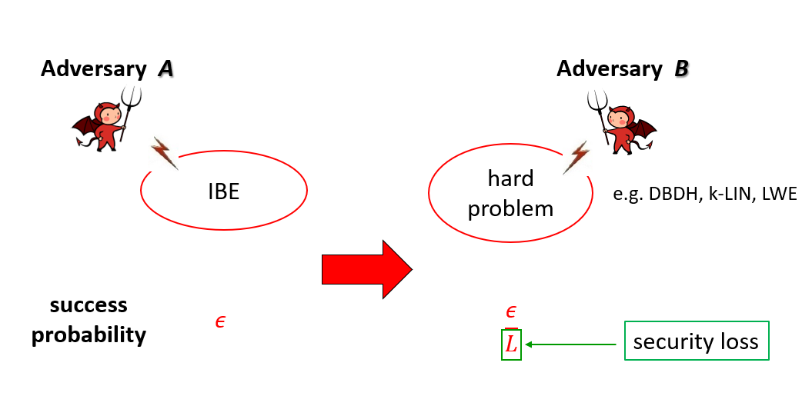

---

title: IBE研究成果
author: dastro yang
date: 2023-12-11
category: Jekyll
layout: post
---

介绍： 

  为了简化公钥密码系统中的证书管理问题，1984年Shamir提出了身份基加密IBE的概念，但直到2001年才由Boneh和Franklin在美密会CRYPTO会上给出了第一个基于随机预言机模型RO（Random Oracle）的可证安全IBE方案，自此之后大量的IBE方案被提出来，最核心的公开问题是：如何在标准模型（不使用随机预言机RO）、标准假设、适应性安全模型下设计具有紧规约的IBE方案。减少规约损耗不仅具有很强的理论意义，对实践应用也非常重要：为了确保相同的安全性，需要用更大的安全参数来弥补规约损耗，换句话说方案的运行效率也会变低。本部分主要介绍实验室在身份基加密IBE方案设计方面的工作，相关成果发表在美密会CRYPTO 2013、亚密会ASIACRYPT 2016&2022、PKC 2016&2017&2021、DCC等上。 
 

工作： 

# 身份基加密IBE的紧规约 

## 1. Fully, (Almost) Tightly Secure IBE from Standard Assumptions and Dual System Groups

[查看原文](https://link.springer.com/chapter/10.1007/978-3-642-40084-1_25)

作者：Jie Chen，Hoeteck Wee

  该工作被“三大会议”（密码学三大顶级会议，美密会CRYPTO、欧密会EUROCRYPT、亚密会ASIACRYPT）引用40次，其中将此成果作为核心技术的后续工作超过20篇，其中： 

  2016年欧密会EUROCRYPT最佳论文《Tightly Secure CCA-Secure Encryption without Pairings》，将我们的技术作为其方案设计和安全性证明的核心工具，论文技术部分多次使用了“follow”等词汇来引用我们的工作； 

  国际著名密码学家Moti Yung（ACM/IEEE/IACR Fellow）等人在亚密会ASIACRYPT 2014的工作《Concise multi-challenge CCA-secure encryption and signatures with almost tight security》和ASIACRYPT 2015《Compactly hiding linear spans: Tightly secure constant-size simulation-sound QA-NIZK proofs and applications》上高度评价了我们解决了公开问题，他们在方案设计和安全性证明时将我们的成果作为其核心技术。 

  成果简介：该工作创新地结合了双系统可证安全方法及伪随机函数技术，基于素数阶群上的DLIN假设，给出了第一个同时具备上述四个特性的IBE方案，其中安全损失只取决于安全参数，与秘钥问询次数无关。 
   
# 非对称双线性群下高效IBE方案

## 1. Shorter IBE via Asymmetric Pairings

[查看原文](https://link.springer.com/chapter/10.1007/978-3-642-36334-4_8)

作者：Jie Chen, Hoon Wei Lim, San Ling, Huaxiong Wang, Hoeteck Wee

  该工作被“三大会议”引用10次，且多次被其它方向（领域）的工作关注和高度评价，包括： 
  IBM研究员Jutla等人在2013年亚密会ASIACRYPT最佳论文《Shorter Quasi-Adaptive NIZK Proofs for Linear Subspaces》中，将我们的成果与其工作做了单独详尽的对比； 
  Moti Yung等人在并行与分布式计算领域著名会议PODC成果《Born and raised distributively: fully distributed non-interactive adaptively-secure threshold signatures with short shares》中特别指出了我们方案的高效性。 
  成果简介：该工作利用非对称双线性群及SXDH计算假设来模拟合数阶群，得到了在非对称双线性群下的IBE等方案，整体效率提高30%以上。 
   