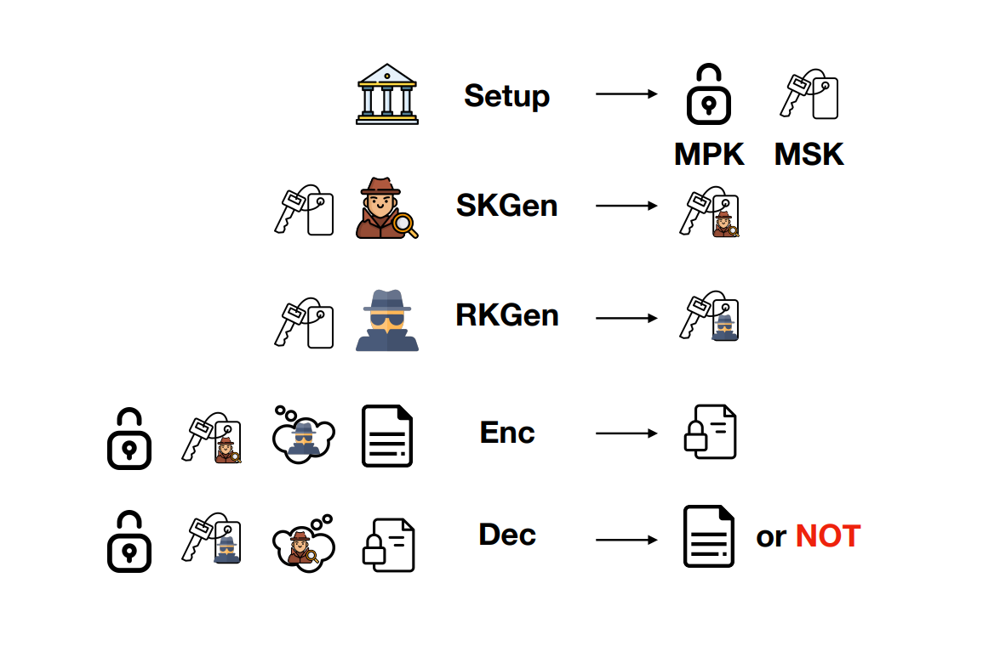

# 身份基匹配加密IB-ME方案的设计

&nbsp;&nbsp;&nbsp;&nbsp;&nbsp;&nbsp;&nbsp;介绍：2019年，Ateniese等人在美密会Crypto中提出了一种新的加密原语“匹配加密”（Matchmaking Encryption），并且给出了第一个可证明安全的身份基匹配加密（Identity-Based Matchmaking Encryption）方案。在IB-ME中，发送方和接收方都可以指定另一方的身份，只有彼此都满足要求才能揭示消息。而之前身份基匹配加密方案要么基于非标准的假设，要么依赖于随机预言机模型。因此，“如何在标准模型和标准假设下构造IB-ME方案”是一个公开问题。本部分主要介绍实验室在身份基匹配加密IB-ME方案设计方面的工作，相关成果发表在亚密会ASIACRYPT 2022。

## 1. Identity-Based Matchmaking Encryption from Standard Assumptions [ASIACRYPT 2022]

作者：Jie Chen, Yu Li, Jinming Wen, Jiang Weng

[查看原文](https://link.springer.com/chapter/10.1007/978-3-031-22969-5_14)

成果简介：

&nbsp;&nbsp;&nbsp;&nbsp;&nbsp;&nbsp;&nbsp;在这项工作中，我们提出首个基于身份的配对加密 (IB-ME)方案，符合标准模型中的标准假设。该方案在素数阶双线性配对群中，基于对称外部Diffie-Hellman (SXDH)假设的前提下被证明是安全的。在我们的IB-ME方案中，所有参数都包含常数数量的群元素，并且比先前的构建更简单。先前的作品要么基于随机预言模 型，要么基于q-类型的假设，而我们的方案直接建立在标准模型上，基于静态假设，并且不依赖其他密码工具。

&nbsp;&nbsp;&nbsp;&nbsp;&nbsp;&nbsp;&nbsp;首先，我们采用了修改自Chen的匿名IBE和签名方案的具有匿名性的两层IBE的变体来构建我们的方案。这带有匿名性和不可伪造性的两层IBE满足IB-ME的相同功能，并且其安全性质巧妙地满足IB-ME的两个要求（隐私和真实性）。IB-ME的隐私属性依赖于第一级IBE的匿名性，而真实性属性对应于第二级的不可伪造性。使用这个两层匿名IBE的变体允许我们的方案在技术上确保发送方和接收方选择的身份可以同时检查，而不泄露任何除了匹配是否成功之外的信息。

&nbsp;&nbsp;&nbsp;&nbsp;&nbsp;&nbsp;&nbsp;其次，这个两层IBE的变体是从 Okamoto 和 Takashima 的双配对向量空间构建的，其安全性降低依赖于 Waters 的双系统加密。在安全性证明过程中，我们借鉴了 Okamoto 和 Takashima 的分层内积加密 中的委托功能的思想，并略微扩展了双系统方法论以适应我们的IB-ME方案。在证明的最后一步，我们依赖信息理论的论证而不是计算论证。这是首次通过在标准假设下结合双配对向量空间和双系统加密来构建基于身份的匹配加密的工作。
