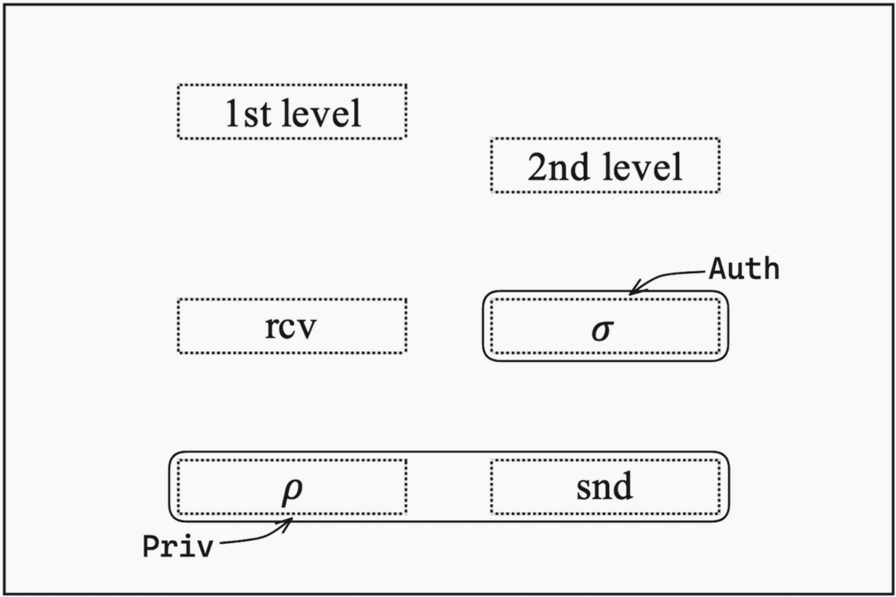

# 身份基匹配加密IB-ME方案的设计

&nbsp;&nbsp;&nbsp;&nbsp;&nbsp;&nbsp;&nbsp;介绍：2019年，Ateniese等人在美密会Crypto中提出了一种新的加密原语“匹配加密”（Matchmaking Encryption），并且给出了第一个可证明安全的身份基匹配加密（Identity-Based Matchmaking Encryption）方案。在IB-ME中，发送方和接收方都可以指定另一方的身份，只有彼此都满足要求才能揭示消息。而之前身份基匹配加密方案要么基于非标准的假设，要么依赖于随机预言机模型。因此，“如何在标准模型和标准假设下构造IB-ME方案”是一个公开问题。本部分主要介绍实验室在身份基匹配加密IB-ME方案设计方面的工作，相关成果发表在亚密会ASIACRYPT 2022。

## Identity-Based Matchmaking Encryption from Standard Assumptions [ASIACRYPT 2022]

作者：Jie Chen, Yu Li, Jinming Wen, Jian Weng

[查看原文](https://link.springer.com/chapter/10.1007/978-3-031-22969-5_14)

成果简介：

&nbsp;&nbsp;&nbsp;&nbsp;&nbsp;&nbsp;&nbsp;在这项工作中，我们在标准模型标准假设下提出首个身份基匹配加密 (IB-ME)方案，所有参数都只包含常数大小的群元素，并且比先前的构建更简单。先前的工作要么基于随机预言模型，要么基于q-类型的假设，而我们的方案直接建立在标准模型上，基于静态假设，并且不依赖其他密码工具。

&nbsp;&nbsp;&nbsp;&nbsp;&nbsp;&nbsp;&nbsp;我们采用了修改自Chen的匿名IBE和签名方案的具有匿名性的两层IBE的变体来构建我们的方案。这带有匿名性和不可伪造性的两层IBE满足IB-ME的相同功能，并且其安全性质巧妙地满足IB-ME的两个要求（隐私和真实性）。IB-ME的隐私属性依赖于第一级IBE的匿名性，而真实性属性对应于第二级的不可伪造性。使用这个两层匿名IBE的变体允许我们的方案在技术上确保发送方和接收方选择的身份可以同时检查，而不泄露任何除了匹配是否成功之外的信息。

