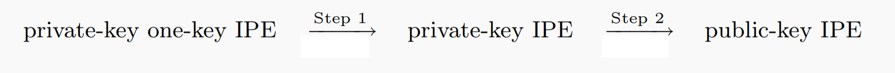

# 内积加密IPE方案的设计

介绍：2008年，Katz等在欧密会EUROCRYPT会上提出了以内积加密IPE为代表的谓词加密的概念，同时他们给出了第一个IPE方案，IPE是当时具有属性隐藏性质的加密系统中功能最强大的（ABE功能更强大，但不具备属性隐藏），IPE的应用也相当广泛，包括关键词搜索、隐藏矢量加密等。而先前的方案只能达到选择性或者半适应性安全，要远弱于适应性安全。这部分介绍实验室在内积加密IPE方案设计方面的工作，相关成果发表在亚密会ASIACRYPT 2018、TCS、DCC等上。

## 1. Improved Inner-product Encryption with Adaptive Security and Full Attribute-hiding [ASIACRYPT 2018]

作者：Jie Chen, Junqing Gong, Hoeteck Wee

[查看原文](https://link.springer.com/chapter/10.1007/978-3-030-03329-3_23)

成果简介：

IPE是一种函数式加密，允许用户以只有在某些向量的内积满足特定条件时才可能解密的方式加密数据。换句话说，它能够根据向量的内积选择性地披露信息。密码方案中的自适应安全通常是指系统针对自适应对手的弹性。在 IPE 的背景下，自适应安全意味着即使对手可以自适应地选择在攻击期间获取哪些信息，系统仍然保持安全。
加密上下文中的属性隐藏意味着密文不会泄露有关与加密数据关联的属性的任何信息。完全属性隐藏意味着加密方案提供了关于属性的完全机密性。

在这项工作中，我们提出了两种素阶双线性群中的 IPE 方案，同时实现自适应安全和完全属性隐藏，在效率方面相较先前 Okamoto 和 Takashima 的IPE方案有25%以上的提升。

--第一个 IPE 方案基于标准的 k-LIN 假设，在较弱的 dLIN = 2-LIN 假设下，比 Okamoto 和 Takashima 的方案具有更短的主公钥和更短的密钥。

--第二个 IPE 方案是根据第一个方案改编的，安全性基于XDLIN假设 (如 Okamoto 的 IPE)，它拥用更短的密文。

从技术上讲，我们不是从合数阶IPE开始并应用现有的转换，而是从一个非常有限的素阶群中IPE方案开始，然后逐步将其升级到我们成熟的IPE方案。

我们采用最优方法结合了2015年提出的”素数阶群中的双系统ABE“和2017年提出的“双线性群中的属性隐藏加密”，第一步将单密钥转化为多密钥 (Unbounded ABE via bilinear entropy expansion, revisited)，第二步将私钥转化为公钥 (Attribute-hiding predicate encryption in bilinear groups, revisited)。
