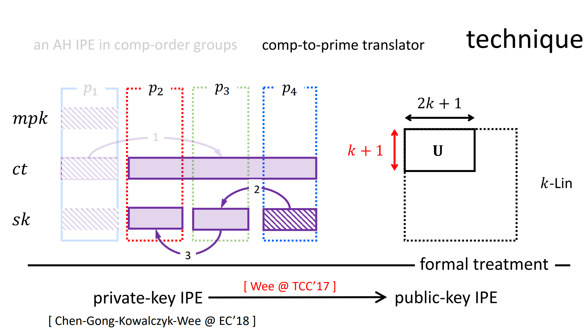

&nbsp;&nbsp;&nbsp;&nbsp;&nbsp;&nbsp;&nbsp;介绍：2008年，Katz等在欧密会EUROCRYPT会上提出了以内积加密IPE为代表的谓词加密的概念，同时他们给出了第一个IPE方案，IPE是当时具有属性隐藏性质的加密系统中功能最强大的（ABE功能更强大，但不具备属性隐藏），IPE的应用也相当广泛，包括关键词搜索、隐藏矢量加密等。而先前的方案只能达到选择性或者半适应性安全，要远弱于适应性安全。这部分介绍实验室在内积加密IPE方案设计方面的工作，相关成果发表在亚密会ASIACRYPT 2018、TCS、DCC等上。

# 内积加密IPE方案的设计

## Improved Inner-product Encryption with Adaptive Security and Full Attribute-hiding [ASIACRYPT 2018]

[查看原文](https://link.springer.com/chapter/10.1007/978-3-030-03329-3_23)

作者：Jie Chen*, Junqing Gong, Hoeteck Wee

成果简介：

&nbsp;&nbsp;&nbsp;&nbsp;&nbsp;&nbsp;&nbsp;内积加密IPE是一种功能强大的原语，具有属性隐藏性质，应用也相当广泛，包括关键词搜索、隐藏矢量加密等。该工作基于一个设定受限的素数阶群IPE方案，给出了一个具有“适应性安全”、“强属性隐藏”的IPE方案，该方案的运行效率较之前工作有25%以上的提升。
       在这项工作中，我们采用最优方法结合了2015年提出的”素数阶群中的双系统ABE“和2017年提出的“双线性群中的属性隐藏加密”，并对MDDH假设进行了进一步的详细的理论分析，提出了两种素阶双线性群中的 IPE 方案，同时实现自适应安全和完全属性隐藏，在效率方面改进了先前 Okamoto 和 Takashima 的IPE方案。